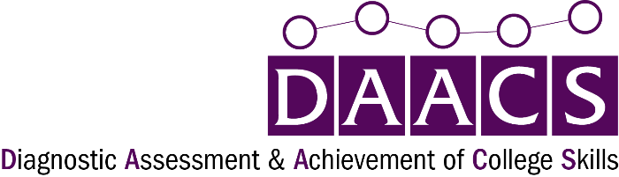

```{r setup, echo=FALSE, results='hide', message=FALSE, warning=FALSE, error=FALSE}
if(FALSE) { # For debugging
	params <- list(user = 'davidwfranklinjr@gmail.com',	config = '../../config.R')
}

library(mongolite)
library(tidyverse)
library(psych)

source(params$config)
source('functions.R', local=TRUE)
source('mappings.R', local=TRUE)

# Read in supporing data files
guide <- as.data.frame(readxl::read_excel('../resources/guide.xlsx'))
writing.rubric <- as.data.frame(readxl::read_excel('../resources/writing/rubric.xlsx'))

# Create database connection
URI <- paste0('mongodb://', mongo.user, ':', mongo.pass, '@',
			  mongo.host, ':', mongo.port, '/', mongo.db)
m.user_assessments <- mongo(url = URI, collection = mongo.collection.assessments)

name <- params$user

# Get student results
srl <- writing <- math <- read <- data.frame()
results <- getUserResults(params$user)
if(nrow(results) > 0) {
	results <- results %>% filter(status == 'GRADED') %>% 
		arrange(desc(takenDate)) %>%
		distinct(assessmentCategory, .keep_all = TRUE)
	
	srl <- results %>% filter(assessmentCategory == 'COLLEGE_SKILLS')
	writing <- results %>% filter(assessmentCategory == "WRITING")
	math <- results %>% filter(assessmentCategory == 'MATHEMATICS')
	read <- results %>% filter(assessmentCategory == 'READING')
	
	if(nrow(results) > 0) {
		name <- paste0(results[1,]$firstName, ' ', results[1,]$lastName)
	}
}
```


```{r, echo=FALSE, results='asis'}
if(knitr::is_html_output()) {
	cat('\n')
} else if(knitr::is_latex_output()) {
	cat('\\begin{wrapfigure}{r}{0.5\\textwidth}\\centering\\vspace{-20pt}\\hspace*{2cm}\\includegraphics[width=0.5\\textwidth]{DAACS_logo.png}\\end{wrapfigure}\n\n')
}
```


\hypertarget{`r name`}{%
\section{`r name`}\label{`r name`}}

\hypertarget{section}{%
\subsection{\texorpdfstring{\textcolor[HTML]{54075B}{DAACS Summary Report}}{}}\label{section}}


\begin{cols}

\begin{col}{0.40\textwidth}


\hypertarget{section-1}{%
\subsubsection{\texorpdfstring{\textcolor[HTML]{54075B}{OVERALL RESULTS}}{}}\label{section-1}}

`r getDotsImage(srl[1,]$overallScore)` `r make_link("Self-Regulated Learning", daacs_link('college_skills', takenDate = srl[1,]$takenDate, userId = srl[1,]$userId))`  

`r getDotsImage(writing[1,]$overallScore)` `r make_link("Writing", daacs_link('writing', takenDate = writing[1,]$takenDate, userId = writing[1,]$userId))`  

`r getDotsImage(math[1,]$overallScore)` `r make_link("Mathematics", daacs_link('mathematics', takenDate = math[1,]$takenDate, userId = math[1,]$userId))`  

`r getDotsImage(read[1,]$overallScore)` `r make_link("Reading", daacs_link('reading', takenDate = read[1,]$takenDate, userId = read[1,]$userId))`

\hypertarget{section-2}{%
\subsubsection{\texorpdfstring{\textcolor[HTML]{54075B}{SELF-REGULATED LEARNING}}{}}\label{section-2}}

```{r srldomainoverview, echo=FALSE, results='asis', escape = FALSE}
if(nrow(srl) > 0) {
	cat(paste0('Completion Date: ', format(srl[1,]$completionDate, '%B %d, %Y'), '  \n\n'))
	for(i in 1:nrow(srl[1,]$domainScores[[1]])) {
		href <- make_link(
			srl_labels[srl[1,]$domainScores[[1]][i,]$domainId],
			daacs_link('college_skills', 
					   domain = srl[1,]$domainScores[[1]][i,]$domainId, 
					   takenDate = srl[1,]$takenDate,
					   userId = srl[1,]$userId)
			)
		cat(paste0(getDotsImage(srl[1,]$domainScores[[1]][i,]$rubricScore), ' ',
				   # capitalize(srl[1,]$domainScores[[1]][i,]$domainId),
				   href,
				   '  \n\n'))
		}
	cat('\n')
}
```


\hypertarget{section-3}{%
\subsubsection{\texorpdfstring{\textcolor[HTML]{54075B}{WRITING}}{}}\label{section-3}}

```{r, echo=FALSE, results='asis'}
if(nrow(writing) > 0) {
	cat(paste0('Completion Date: ', format(writing[1,]$completionDate, '%B %d, %Y'), '  \n\n'))
	for(i in 1:nrow(writing[1,]$domainScores[[1]])) {
		href <- make_link(
			capitalize(writing[1,]$domainScores[[1]][i,]$domainId),
			daacs_link('writing', 
					   domain = writing[1,]$domainScores[[1]][i,]$domainId, 
					   takenDate = writing[1,]$takenDate,
					   userId = writing[1,]$userId)
			)
		cat(paste0(getDotsImage(writing[1,]$domainScores[[1]][i,]$rubricScore), ' ',
				   # capitalize(writing[1,]$domainScores[[1]][i,]$domainId),
				   href,
				   '  \n\n'))
	}
	cat('\n')
} else {
	cat('No results found.')
}
```

\hypertarget{section-4}{%
\subsubsection{\texorpdfstring{\textcolor[HTML]{54075B}{MATHEMATICS}}{}}\label{section-4}}


```{r, echo=FALSE, results='asis'}
if(nrow(math) > 0) {
  cat(paste0('Completion Date: ', format(math[1,]$completionDate, '%B %d, %Y'), '  \n\n'))
  for(i in 1:nrow(math[1,]$domainScores[[1]])) {
		href <- make_link(
			capitalize(math[1,]$domainScores[[1]][i,]$domainId),
			daacs_link('mathematics', 
					   domain = math[1,]$domainScores[[1]][i,]$domainId, 
					   takenDate = math[1,]$takenDate,
					   userId = math[1,]$userId)
			)
    cat(paste0(getDotsImage(math[1,]$domainScores[[1]][i,]$rubricScore), ' ',
    		   # capitalize(math[1,]$domainScores[[1]][i,]$domainId),
    		   href,
               '  \n\n'))
  }
  cat('\n')
} else {
	cat('No results found.')
}
```

\hypertarget{section-5}{%
\subsubsection{\texorpdfstring{\textcolor[HTML]{54075B}{READING}}{}}\label{section-5}}

```{r, echo=FALSE, results='asis'}
if(nrow(read) > 0) {
  cat(paste0('Completion Date: ', format(read[1,]$completionDate, '%B %d, %Y'), '  \n\n'))
  for(i in 1:nrow(read[1,]$domainScores[[1]])) {
		href <- make_link(
			capitalize(read[1,]$domainScores[[1]][i,]$domainId),
			daacs_link('reading', 
					   domain = read[1,]$domainScores[[1]][i,]$domainId, 
					   takenDate = read[1,]$takenDate,
					   userId = read[1,]$userId)
			)
    cat(paste0(getDotsImage(read[1,]$domainScores[[1]][i,]$rubricScore), ' ',
    		   # capitalize(read[1,]$domainScores[[1]][i,]$domainId),
    		   href,
               '  \n\n'))
  }
  cat('\n')
} else {
	cat('No results found.')
}
```


\end{col}

\begin{col}{0.05\textwidth}
~

\end{col}

\begin{col}{0.55\textwidth}

\vspace{0pt}


```{r, echo=FALSE, results='asis'}
res <- knitr::knit_child(params$tips_rmd, quiet = TRUE)
cat(res, sep = '\n')
```


\end{col}

\end{cols}


`r if(nrow(writing) > 0) { new_page() }`


```{r, echo=FALSE, results='asis'}
if(nrow(writing) > 0) {
	#cat(paste0('### ', colorize("ESSAY", "54075B")))
	cat('\\hypertarget{section-10}{%\n')
	cat("\\subsubsection{\\texorpdfstring{\\textcolor[HTML]{54075B}{ESSAY}}{}}\\label{section-10}}\n")
	cat('\n\n')
	text <- writing[1,]$writingPrompt$sample
	text <- unlist(strsplit(text, '\n'))
	text <- trimws(text)
	text <- stringi::stri_trans_general(text, "latin-ascii")
	
	text <- gsub('\\[', '', text)
	text <- gsub('\\]', '', text)
	# text <- gsub('\n', '\n\n', text)
	# text <- gsub('\t', '', text)
	# text <- gsub('^\\s*', '', text)
	# text <- gsub('\n\s*', '\n', text)

	cat(paste0(text, collapse = '\n\n'))
}
```

`r if(nrow(srl) > 0) { new_page() }`


```{r srl-results, echo=FALSE, message=FALSE, warning=FALSE, results='asis'}
if(nrow(srl) > 0) {
	#cat(paste0('### ', colorize("SELF-REGULATED LEARNING", '54075B')))
	cat('\\hypertarget{section-11}{%\n')
	cat('\\subsubsection{\\texorpdfstring{\\textcolor[HTML]{54075B}{SELF-REGULATED LEARNING}}{}}\\label{section-11}}\n')
	cat('\n\n')
	
	takenDate <- srl[1,]$takenDate + 0.0005 # See https://stackoverflow.com/questions/10931972/r-issue-with-rounding-milliseconds
	takenDate <- gsub(':', '%3A', format(takenDate,'%Y-%m-%dT%H:%M:%OS3Z', tz = 'GMT'))

	srl_items <- getStudentResponses(srl, 1)
	tab <- describeBy(srl_items$score, group = srl_items$domain, mat = TRUE, skew = FALSE)
	tab <- tab %>% arrange(desc(mean))
	row.names(tab) <- tab$group1
	tab$link <- paste0(daacs.base.url, '/', srl_links[tab$group1],
					   '?userId=', srl[1,]$userId, '&takenDate=', takenDate)
	
	p <- ggplot(tab, aes(x = group1, y = mean)) +
		geom_segment(aes(x = group1, xend = group1, y = 0, yend = mean), alpha = 0.5, size = 1) +
		geom_point(color = '#54075B', size = 5) +
		coord_flip() +
		xlab('') + ylab('') +
		scale_x_discrete(limits = rev(tab$group1),
						 labels = rev(srl_labels[tab$group1])) +
		scale_y_continuous(breaks = c(2, 3, 4), 
						   limits = c(0, 4),
						   labels = c('Developing', 'Emerging', 'Mastering')) +
		theme_minimal() +
		theme(panel.grid.minor.x = element_blank(),
			  axis.text.x = element_text(hjust = 1))
	
	p
	
	# https://stackoverflow.com/questions/42259826/hyperlinking-text-in-a-ggplot2-visualization
	#  ggsave( tf1 <- tempfile(fileext = ".svg"), p)
	#  # links <- with(df, setNames(link, car))
	#  
	#  xml <- xml2::read_xml(tf1)
	#  xml %>%
	#  	xml2::xml_find_all(xpath="//d1:text") %>% 
	#  	keep(xml2::xml_text(.) %in% names(srl_links)) %>% 
	#  	xml2::xml_add_parent("a", "xlink:href" = links[xml_text(.)], target = "_blank")
	#  xml2::write_xml(xml, tf2 <- tempfile(fileext = ".svg"))
	# cat(paste(readLines(tf2), collapse = "\n"))
	# library(grid)
	# grid.force()
	# ## List all grobs in plot
	# grid.ls()
	# ## Find the grobs representing the text labels on the axes
	# tickLabels <- grid.grep("axis::text", grep=TRUE, global=TRUE)
	# ## Check which one is the y-axis
	# lapply(tickLabels, function(x) grid.get(x)$label)
	# 
	# ## Add hyperlinks to the axis tick labels
	# library(gridSVG)
	# grid.hyperlink(tickLabels[[1]],
	#                href=tab$link,
	#                group=FALSE)
}
```

Here are three areas of self-regulated learning that you might want to work on, along with tips you can start using right away. Click on any of the areas of SRL in the text below to learn more.

```{r srl-tips, echo=FALSE, message=FALSE, warning=FALSE, results='asis'}
if(nrow(srl) > 0) {
	srl_items <- getStudentResponses(srl, 1)
	tab <- describeBy(srl_items$score, group = srl_items$domain, mat = TRUE, skew = FALSE)
	tab <- tab %>% arrange(mean)
	tip_num <- 1
	for(i in 1:nrow(tab)) { # how many tips to include
		tipfile <- paste0('tips/', srl_tips[tab[i,]$group1])
		if(file.exists(tipfile)) {
			tips <- readLines(tipfile)
			cat(tips, sep = '\n')
			cat('\n\n')
			tip_num <- tip_num + 1
			if(tip_num > params$num_tips) {
				break;
			}
		}
	}
}
```

